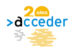

<!--html><a href="https://www.gitanos.org/20anosacceder/" target="_blank">

</html--> 
  

E-mail: [jose@jrgarcia.es](mailto:jose@jrgarcia.es){:target="_blank"} | Aula Virtual: [aula.jrgarcia.es](https://aula.jrgarcia.es/){:target="_blank"} (Apagada)   

En el menú lateral encontrarás información sobre mi [Experiencia](experiencia.md) y [Formación](formacion.md) y también sobre módulos de [Certificados de Profesionalidad](docencia.md) en los que estoy acreditado para impartir Formación Profesional para el Empleo. 

También puedes consultar [enlaces](enlaces.md) a sitios web que consulto habitualmente y también acceder al [Blog](blog.md) donde encontrarás artículos de interés.

Soy prospector de empleo del Programa ACCEDER de la Fundación Secretariado Gitano en Santiago de Compostela. 

Acceder es el Programa de Empleo de la Fundación Secretariado Gitano centrada en funciones de:

> ▪ Servicio público de intermediación laboral dirigido a empresas y desempleados/as.
>  ▪ Intermediación con empresas con la finalidad de poner en contacto ofertas y demandas de empleo. 
> ▪ Firma de convenios con empresas para la colaboración en procesos de formación y prácticas.
> ▪ Orientación y formación en búsqueda activa de empleo.
> ▪ Selección de perfiles profesionales.
> ▪ Aplicación de metodologías de análisis de la empleabilidad de candidatos mediante la gestión por competencias. 
> ▪ Planes individualizados y acciones formativas a la carta para empresas.
> ▪ Servicios gratuitos, flexibles y eficaces.

✓ El objetivo principal es mejorar la situación de personas pertenecientes a comunidades en riesgo de exclusión social, aumentando su presencia en el mercado laboral, la contratación y la calidad de los puestos de trabajo.

